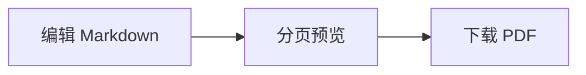

# Markdown 语法示例 {#overview}

[TOC]

## 基础格式

**粗体**、*斜体*、~~删除线~~、`行内代码`、==高亮==、++插入线++。
H~2~O、x^2^、:smile:，以及转义符号 \*星号\*。

链接支持 [直接链接](https://example.com) 和 [引用链接][site]。

[site]: https://example.com "示例网站"

1. 有序列表
   - 嵌套项目
   - 第二个项目
2. 第二项

- [x] 已完成任务
- [ ] 待办任务

> 普通引用
>
> > 嵌套引用

## 提示块

> [!NOTE]
> **加粗内容**和[链接](https://example.com)会保留。

::: warning 自定义提示标题
请使用 UTF-8 编码保存 Markdown 文件。
:::

## 表格

| 左对齐 | 居中 | 右对齐 |
| :--- | :---: | ---: |
| **文本** | `a\|b` | 123 |
| 中文 | [链接][site] | 456 |

## 公式

行内美元公式：$E=mc^2$，括号公式：\(a^2+b^2=c^2\)。

$$
\int_0^1 x^2\,dx = \frac{1}{3}
$$

\[
\begin{pmatrix}1 & 2 \\ 3 & 4\end{pmatrix}
\]

```math
f(x)=\sum_{n=1}^{\infty}\frac{x^n}{n!}
```

## 图表与图片



![本地引用图片][illustration]

[illustration]: diagram.svg

{width=260}

## 定义、缩写、脚注

Markdown
: 一种文本标记语言。

HTML 用于文档结构。

*[HTML]: HyperText Markup Language

这是一条带脚注的说明[^example]。

[^example]: 脚注中也可以使用 **Markdown 格式**。

## 内嵌 HTML

<details open>
<summary>展开内容</summary>
<p>支持 <kbd>Ctrl</kbd>、<sup>上标</sup>、<sub>下标</sub> 和安全 HTML 表格。</p>
</details>

<!-- pagebreak -->

## 新的一页

分页标记可使用 `[pagebreak]`、`{pagebreak}` 或 HTML 注释。

```md
代码块中的 [pagebreak] 会原样显示。
```

```ts
const message: string = '中文代码高亮';
console.log(message);
```
