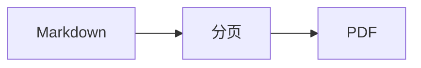

# CommonMark 与 GFM

[TOC]

## 文本与列表

**加粗**、*斜体*、~~删除线~~、`行内代码`、==高亮==、++插入++、H~2~O、x^2^、:smile:。

1. 第一项
   - 子项目
2. 第二项

- [x] 已完成
- [ ] 未完成

> [!NOTE]
> 提示块中的 **格式** 和 [链接](https://example.com)。

## 表格和代码

| 左列 | 居中 | 右列 |
| :--- | :---: | ---: |
| 中文 | **粗体** | 123 |
| 文本 | `a\|b` | 456 |

```ts
function greet(name: string) {
  return `Hello ${name}`;
}
```

[pagebreak]

## 公式、图表和文档扩展

行内 $E=mc^2$，括号公式 \(a^2+b^2=c^2\)。

$$
\int_0^1 x^2\,dx=\frac{1}{3}
$$



::: tip 文档扩展
定义列表、缩写和脚注可以一起使用。
:::

Markdown
: 标记语言。

HTML 与脚注[^note]。

*[HTML]: HyperText Markup Language

[^note]: **脚注内容**。

<details open><summary>安全 HTML</summary><p><kbd>Ctrl</kbd> + <kbd>P</kbd></p></details>
